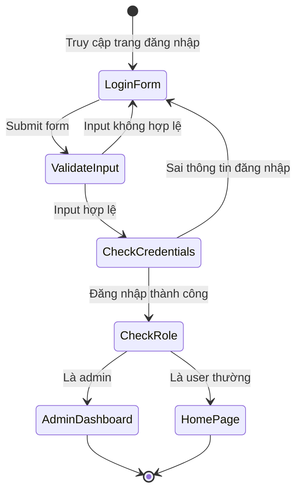
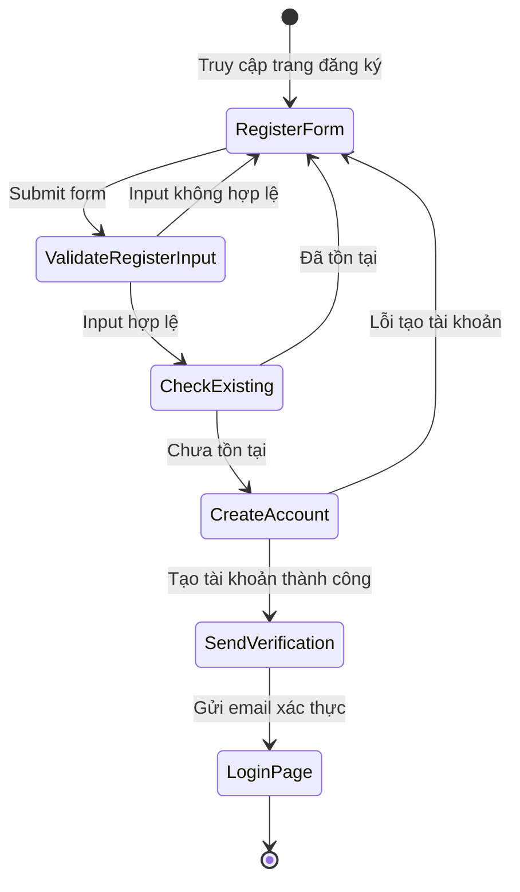
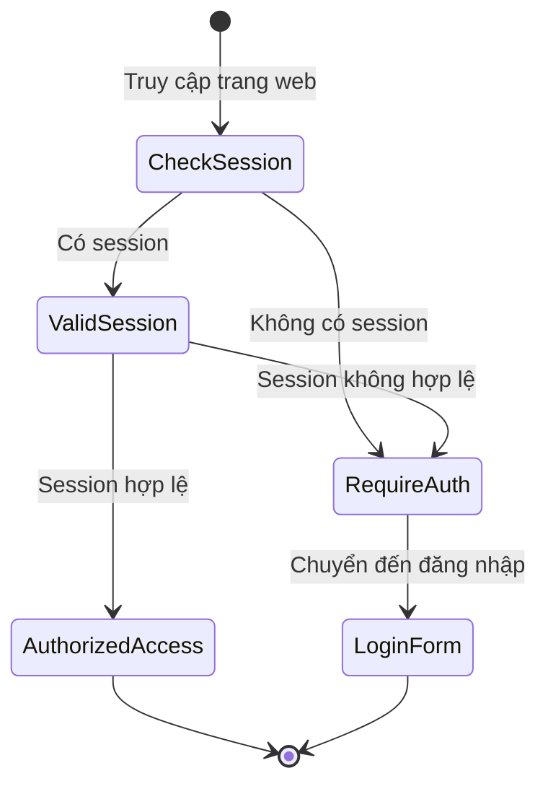
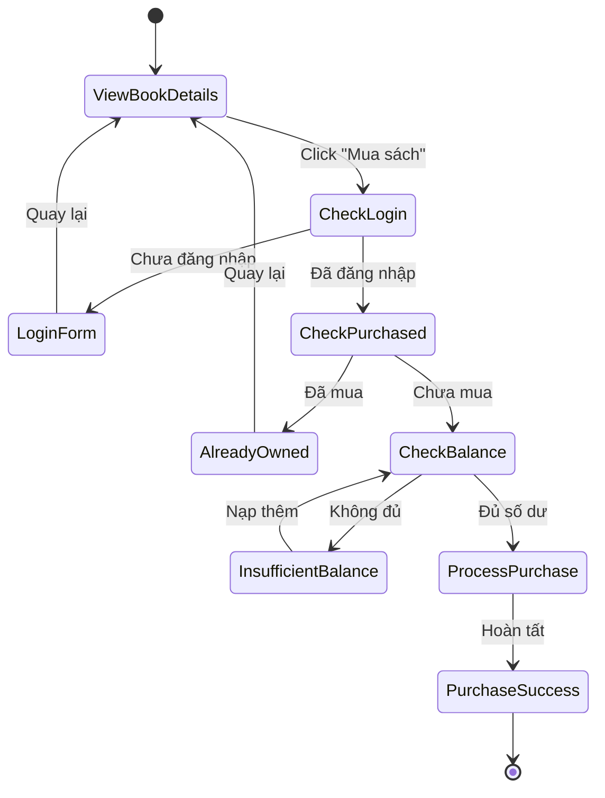
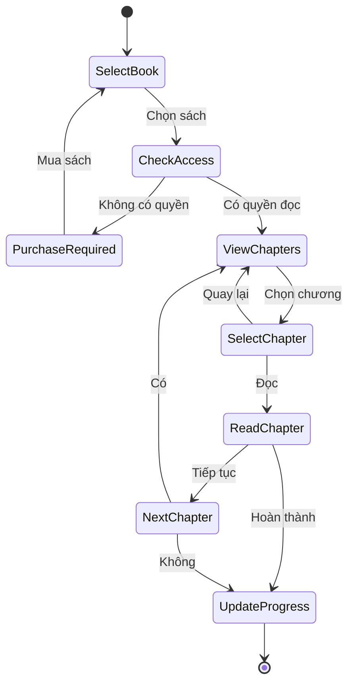
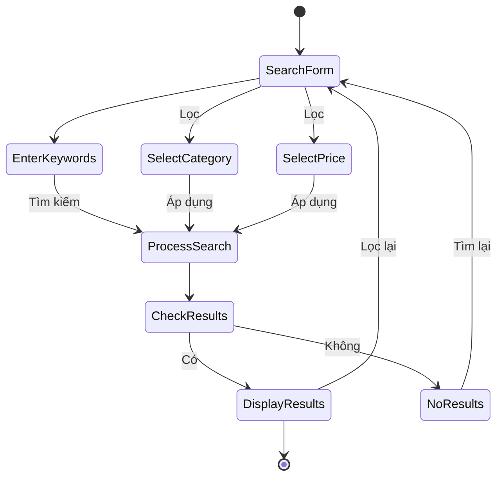

# Sơ đồ trạng thái xác thực (Authentication Flow)

## 1. Sơ đồ trạng thái đăng nhập (Login Flow)



### Chi tiết các trạng thái:

1. **LoginForm**
   - Hiển thị form đăng nhập
   - Yêu cầu username/email và password
   - Có link chuyển đến trang đăng ký
   - Có chức năng "Quay về trang chủ"

2. **ValidateInput**
   - Kiểm tra các trường không được để trống
   - Kiểm tra định dạng email (nếu đăng nhập bằng email)
   - Kiểm tra độ dài username và password

3. **CheckCredentials**
   - Kiểm tra thông tin đăng nhập trong database
   - Xác thực mật khẩu
   - Tạo session cho user

4. **CheckRole**
   - Kiểm tra role của user (admin/user)
   - Điều hướng đến trang tương ứng

## 2. Sơ đồ trạng thái đăng ký (Register Flow)



### Chi tiết các trạng thái:

1. **RegisterForm**
   - Hiển thị form đăng ký
   - Yêu cầu: username, email, password, xác nhận password
   - Có link chuyển đến trang đăng nhập
   - Có chức năng "Quay về trang chủ"

2. **ValidateRegisterInput**
   - Kiểm tra các trường không được để trống
   - Kiểm tra định dạng email
   - Kiểm tra độ dài và độ mạnh của password
   - Kiểm tra password và confirm password khớp nhau
   - Kiểm tra username chỉ chứa ký tự hợp lệ

3. **CheckExisting**
   - Kiểm tra username đã tồn tại
   - Kiểm tra email đã tồn tại

4. **CreateAccount**
   - Tạo bản ghi user mới trong database
   - Mã hóa password
   - Tạo avatar mặc định
   - Thiết lập role mặc định

5. **SendVerification**
   - Tạo mã xác thực
   - Gửi email xác thực (optional)
   - Hiển thị thông báo thành công

## 3. Xử lý Session



### Các biến session quan trọng:

```php
$_SESSION['user_id']      // ID của user
$_SESSION['username']     // Tên đăng nhập
$_SESSION['role']        // Vai trò (admin/user)
$_SESSION['avatar_url']  // URL avatar
$_SESSION['last_login']  // Thời gian đăng nhập
```

## 4. Xử lý lỗi và thông báo

- Sử dụng `$_SESSION['error']` để lưu thông báo lỗi
- Sử dụng `$_SESSION['success']` để lưu thông báo thành công
- Hiển thị thông báo bằng Bootstrap Alert
- Xóa thông báo sau khi hiển thị

## 5. Bảo mật

1. **Chống tấn công XSS**
   - Sử dụng `htmlspecialchars()` khi hiển thị dữ liệu
   - Validate input kỹ lưỡng

2. **Chống tấn công SQL Injection**
   - Sử dụng Prepared Statements
   - Tham số hóa các câu truy vấn

3. **Bảo vệ mật khẩu**
   - Mã hóa mật khẩu trước khi lưu
   - Không lưu mật khẩu gốc
   - Kiểm tra độ mạnh của mật khẩu

4. **Bảo vệ Session**
   - Regenerate session ID sau khi đăng nhập
   - Kiểm tra IP và User Agent
   - Thiết lập thời gian timeout 

## 6. Sơ đồ trạng thái mua sách (Purchase Flow)



### Chi tiết các trạng thái mua sách:

1. **ViewBookDetails**
   - Hiển thị thông tin chi tiết sách
   - Giá tiền, mô tả, đánh giá
   - Nút "Mua sách" nếu là sách trả phí

2. **CheckLogin**
   - Kiểm tra trạng thái đăng nhập
   - Điều hướng đến form đăng nhập nếu chưa đăng nhập

3. **LoginForm**
   - Hiển thị form đăng nhập
   - Yêu cầu username/email và password
   - Có link chuyển đến trang đăng ký
   - Có chức năng "Quay về trang chủ"

4. **CheckPurchased**
   - Kiểm tra lịch sử mua sách
   - Kiểm tra quyền truy cập

5. **AlreadyOwned**
   - Hiển thị thông báo và quay lại trang chi tiết sách nếu đã mua

6. **CheckBalance**
   - Kiểm tra số dư
   - Điều hướng đến trang nạp tiền nếu không đủ số dư

7. **InsufficientBalance**
   - Hiển thị thông báo và quay lại trang kiểm tra số dư

8. **ProcessPurchase**
   - Xử lý giao dịch thanh toán
   - Cập nhật lịch sử mua
   - Ghi log giao dịch

9. **PurchaseSuccess**
   - Hiển thị thông báo thành công
   - Điều hướng đến trang đọc sách

## 7. Sơ đồ trạng thái đọc sách (Reading Flow)



### Chi tiết các trạng thái đọc sách:

1. **SelectBook**
   - Hiển thị danh sách sách
   - Cho phép chọn sách

2. **CheckAccess**
   - Kiểm tra quyền đọc sách
   - Điều hướng đến trang mua sách nếu chưa có quyền

3. **PurchaseRequired**
   - Hiển thị thông báo và quay lại trang chọn sách nếu chưa có quyền

4. **ViewChapters**
   - Hiển thị danh sách chương
   - Cho phép chọn chương

5. **SelectChapter**
   - Chọn chương
   - Điều hướng đến nội dung chương

6. **ReadChapter**
   - Đọc nội dung chương
   - Cập nhật tiến độ đọc

7. **UpdateProgress**
   - Lưu tiến độ đọc
   - Cập nhật lịch sử đọc

8. **NextChapter**
   - Điều hướng đến chương tiếp theo
   - Cập nhật tiến độ đọc

## 8. Sơ đồ trạng thái tìm kiếm sách (Search Flow)



### Chi tiết các trạng thái tìm kiếm:

1. **SearchForm**
   - Hiển thị form tìm kiếm
   - Cho phép nhập từ khóa
   - Cho phép lọc theo thể loại
   - Cho phép lọc theo giá tiền

2. **EnterKeywords**
   - Nhập từ khóa

3. **SelectCategory**
   - Lọc theo thể loại

4. **SelectPrice**
   - Lọc theo giá tiền

5. **ProcessSearch**
   - Xử lý tìm kiếm

6. **CheckResults**
   - Kiểm tra và hiển thị kết quả

7. **DisplayResults**
   - Hiển thị sách phù hợp
   - Phân trang kết quả
   - Thống kê số lượng

8. **NoResults**
   - Hiển thị thông báo không tìm thấy kết quả
   - Cho phép tìm lại

## Flow Descriptions

### Purchase Flow
1. Bắt đầu từ trang chi tiết sách
2. Kiểm tra trạng thái đăng nhập khi click "Mua sách"
3. Nếu chưa đăng nhập, chuyển đến form đăng nhập
4. Sau khi đăng nhập, kiểm tra trạng thái mua sách
5. Nếu đã mua, hiển thị thông báo và quay lại
6. Nếu chưa mua, kiểm tra số dư
7. Xử lý mua sách nếu đủ số dư
8. Hiển thị kết quả mua sách

### Reading Flow
1. Bắt đầu từ việc chọn sách
2. Kiểm tra quyền đọc sách
3. Yêu cầu mua sách nếu chưa có quyền
4. Hiển thị danh sách chương nếu có quyền
5. Cho phép đọc từng chương
6. Cập nhật tiến độ đọc
7. Cho phép chuyển tiếp hoặc quay lại

### Search Flow
1. Hiển thị form tìm kiếm
2. Cho phép nhập từ khóa và áp dụng bộ lọc
3. Xử lý tìm kiếm
4. Kiểm tra và hiển thị kết quả
5. Cho phép tìm lại hoặc lọc lại kết quả 